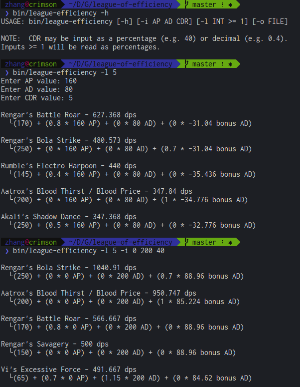

# League of Efficiency
This program returns the most efficient spell in the game by using data from the official Riot Games developer API.

The project uses the open source libraries [JsonCpp](https://github.com/open-source-parsers/jsoncpp) and [libcURL](http://curl.haxx.se/libcurl/) to handle the API over https.



# Considerations to Note
This program does not do exactly what it could or should do; this is because of several reasons.

 * Some champions simply have mechanics too complicated to handle without hard coding; especially the champions with two different spells per button (Jayce and Elise) this is extremely difficult.
 * The only available parameters to me are AP, AD and CDR. I do not have attack speed, critical chance, or critical damage, all of which can affect the true damage output of certain skills.
 * I assume that the champion's level is maxed out at 18, with all skills at maximum rank. However, due to skills scaling differently, certain skills may be better at certain points during any given game.
 * Some spells like Akali's Shadow Dance have secondary cooldowns; I do not consider this secondary cooldown, instead looking at the high bound of efficiency. However, this does skew the results a bit.
 * Rengar's cooldowns are currently absurdly low (0.5 low). Not sure if this is a bug with the API data since none of his actual cooldowns are this low, but this puts Rengar's skills at the top of the list in many cases.

I also realize that spell efficiency is not only measured by DPS; healing, crowd control, and buffing/debuffing are all different aspects of spells that this program does not consider.
Damaging spells are the most common spell in the game however, and generally one of the more interesting statistics due to the variability in scaling.

All that being said - I would love to flesh out the program in more detail in the future.

# Build & Requirements
Before building, make sure you have:

 * libcURL >= 7 (try ```curl-config --version```)
 * g++ >= 4.3 (requires C++11 support)
 * CMake >= 2.8

This project uses a super simple CMake build. Simply call the following to build the entire project:

```
$ mkdir build && cd build
$ cmake ..
$ make
```

After that you can find the executables in the ```bin/``` folder.

And... that's it! That's literally it. Go ham.

# Running

Run the program in a folder with a file called ```api.key``` that contains only the Riot API key.

# Input
The available parameters are:

 * Ability Power (AP)
 * Attack Damage (AD)
 * Cooldown Reduction (CDR)

This program comes with several optional arguments, listed below. Otherwise the program reads input via STDIN.

 * ```-h``` display help information
 * ```-i``` input parameters, space-delimited; ex: ```-i ap ad cdr```
 * ```-l``` list ```x``` most efficient spells; ex: ```-l x```
 * ```-o``` output to file

 You may input CDR as a decimal or an integer; just keep in mind that the program will get cranky if you pass it invalid numbers.

# Output
The program's default output will show both the most efficient damaging spell in DPS (damage per second), as well as some other trivial information about the spell itself.

With the ```-l``` switch, the program can output up to the ```x```th most efficient spell, allowing you to look at close contenders as well as dismiss potential outliers.

With the ```-o``` switch, the program outputs to a specified filepath if it's able to open it for writing.
